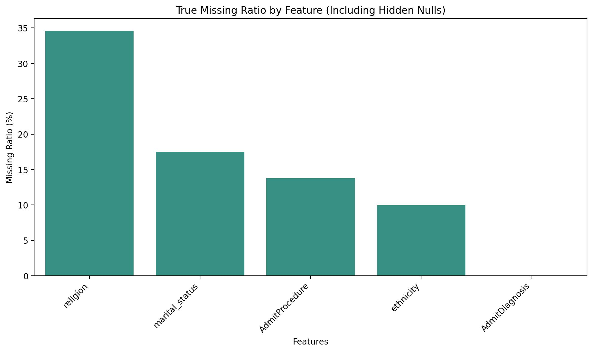
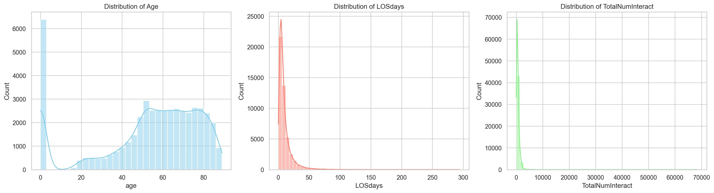
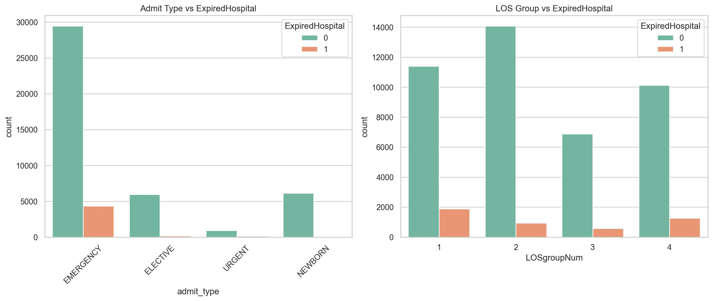

# 作業與資料集簡介

## 作業目標摘要
本作業的目標為完整進行一次醫療資料探勘前處理流程，將結構複雜、混亂且提供給「人」看的資料轉化為適合機器學習演算法輸入的乾淨資料集。過程中需進行資料探索分析（EDA），藉以理解病患屬性、醫療互動頻率及主要診斷與最終院內死亡（ExpiredHospital）間的潛在關聯。
作業涵蓋缺失值填補、極端值檢視、數值標準化以及類別特徵編碼（如 Target Encoding 與 One-Hot Encoding）。
此外，亦整合特徵工程與 PCA 降維技術，萃取出代表醫療負擔與複雜度的衍生變數。最終產出清洗乾淨可送入模型的資料表（`df_model_ready`）。
最後，完整的作業內容亦可於[github link](https://github.com/LiYuChs/DMML-A1/tree/main/A1_1158029_%E6%9D%8E%E5%AE%87%E6%99%9F) 查看。

## Kaggle 資料集連結與主要欄位概述
本作業資料來源為 [MIMIC-III Clinical Database Demo](https://www.kaggle.com/datasets/drscarlat/mimic3c/data)
核心欄位涵蓋：
* **病患基本特徵**：`age`（年齡）、`gender`（性別）、`marital_status`（婚姻狀態）與 `ethnicity`（種族）。
* **入院資訊**：`admit_type`（入院類型）、`admit_location`（入院來源）、`AdmitDiagnosis`（初步診斷）與 `AdmitProcedure`（入院處置）。
* **住院與臨床指標**：`LOSdays`（Length of Stay，住院天數）與 `TotalNumInteract`（總醫療互動次數，匯總了各項檢驗與給藥紀錄）。
* **目標變數**：`ExpiredHospital`（院內死亡註記），為二元預測標籤。

---

# 資料理解（Data Understanding）

## 資料基本統計
* **資料列數**：共有 58,976 筆觀測值。
* **欄位數**：原始資料共 28 個欄位。
* **欄位型態**：包含二元目標變數、數值型連續變數（如 `age`、`LOSdays`）以及類別型變數（如 `admit_type`、`religion`）。
* **資料切分**：train/test（47180, 80% / 11796, 20%），random seed 設置為 42，並且後續的資料分析都以 training set 進行分析。

## 5 個重要欄位的臨床或業務意義說明

1. **`ExpiredHospital`**：核心目標變數，標示病患最終是否於住院期間過世（1 為過世，0 為存活），是臨床資源分配與風險管控的最高指導指標。

2. **`LOSdays`**：病患的總住院天數。住院天數越長通常暗示著病情複雜、併發症風險高或是恢復狀況不如預期，是評估醫療成本與病床週轉率的關鍵依據。

3. **`TotalNumInteract`**：住院期間所有醫療互動的總次數。此數值能綜合反映出病患所需的護理強度、用藥頻率及生命徵象監測密度，數值極高者往往代表重症患者。

4. **`admit_type`**：病患進入醫院的途徑。緊急入院（EMERGENCY）通常代表病情危急且無法預期，相較於擇期手術（ELECTIVE），其致死風險與應變難度顯著較高。

5. **`AdmitDiagnosis`**：入院時的主要病因診斷。特定診斷（如敗血症 SEPSIS 或心衰竭 CONGESTIVE HEART FAILURE）在臨床上有已知的高致死率，此欄位能提供模型極具鑑別度的先驗醫學知識。

## 缺失值與資料品質的關鍵觀察（missing_value_stats.csv）
（參考 Jupyter cell 表一，或是 output/missing_value_stats.csv）

1. 不做任何處理單純檢視資料集中的缺失值，發現 `AdmitDiagnosis`、`religion`、`marital_status` 欄位存在缺失值。

2. 觀察資料集發現除了單純的 "Nan" 資料，在 `marital_status` 中發現 281 筆資料為 "UNKNOWN (DEFAULT)"，因此先將其統一替換成 "Nan"。

3. 在 `AdmitProcedure` 中發現 6,500 筆資料為 "na"，同樣先替換成 "Nan"。

4. 在 `religion` 中，有 9,433 筆 "NOT SPECIFIED" 與 6,522 筆 "UNOBTAINABLE"，先將其統一替換成 "Nan"。

5. 在 `ethnicity` 中，包含 3,641 筆 "UNKNOWN/NOT SPECIFIED"、626 筆 "UNABLE TO OBTAIN" 以及 447 筆 "PATIENT DECLINED TO ANSWER"，先將其統一替換成 "Nan"。

### 缺失比例圖表（missing_value_ratio.jpg）

由圖表可快速確認「真實缺失比例（含隱性缺失字串轉換後）」的分佈情形，重點百分比如下：

1. `religion`：約 **34.60%**，為缺失比例最高欄位。

2. `marital_status`：約 **17.48%**，且與 `age = 0`（新生兒）高度相關。

3. `AdmitProcedure`：約 **13.78%**，主要來自字串 "na"。

4. `ethnicity`：約 **10.00%**，多為「未知 / 拒答 / 無法取得」類別。

---

# 探索性分析重點（EDA Highlights）

## 連續變數分佈的主要發現

### 連續變數分佈圖表（distribution_plots.jpg）

1. 連續變數 `age` 呈現雙峰分佈，後續在做前處理時需要先做 log transform 再做標準化。

2. 連續變數 `LOSdays` 展現出高度的右偏（長尾）分佈特徵。
多數病患的住院天數不長，導致其中位數僅 6.42 天，但由於少數長期住院的重症病患拉抬，整體平均數被推升至 10.1 天，標準差更高達 12.42 天（數據可參考 output/eda_key_stats.csv）。

3. 連續變數 `TotalNumInteract` 展現出高度的右偏（長尾）分佈特徵。
中位數為 498.39、平均數為 634.66、標準差高達 748.11，且最大值達 68,600.0（最小值 0.0），顯示少數高互動重症個案明顯拉長右尾（數據可參考 output/eda_key_stats.csv）。

## 類別變數分佈的主要發現

### 類別變數與預測目標關係（expired_hospital.jpg）

1. `admit_type`
從圖表中可看出，EMERGENCY 佔據了絕大多數的資料量，且橘色區塊（死亡 ExpiredHospital = 1）的相對比例明顯比 ELECTIVE 來得高。

2. `LOSgroupNum`
各個住院天數組別的存活與死亡比例分佈。住院天數 1 與 4 的群組，包含相對高的死亡個案，推測可能原因為住院天數極短（症狀嚴重導致死亡）以及住院天數極長（需要即時長期關注之病患，症狀嚴重）。

## 分組重點統計

1. 性別分佈與風險差異（參考 Jupyter cell 表三）
分佈狀況：整體資料庫中，男性病患（26,499 人）的數量略多於女性病患（20,661 人）。
風險觀察：儘管男性佔多數且平均住院天數（10.21 天）略長於女性（9.95 天），但女性的平均死亡率（10.40%）卻高於男性（9.56%）。性別在特定疾病的致死率上可能存在差異，後續建模時保留性別特徵。

2. 急診為主要的高風險來源（參考 Jupyter cell 表四）
急診（EMERGENCY）是最大宗的入院途徑（33,798 人），且伴隨最高比例的死亡率（12.87%）。這符合臨床常理：急診病患多為突發性重症，病情惡化快速且難以預測。

緊急入院（URGENT）病患雖僅有 1,045 人，但其平均住院天數最長（12.52 天），且死亡率亦高達 12.06%，顯示這是一群需要大量醫療資源且病情不穩定的患者。

擇期手術（ELECTIVE）病患（6,131 人）因有事前的妥善評估與準備，死亡率僅 2.56%。

新生兒（NEWBORN）共 6,186 人，平均年齡為 0 歲，其死亡率極低（僅 0.79%）。然而，他們的平均住院天數卻高達 11.42 天，這通常與早產或新生兒加護病房的觀察期有關。

3. 族群多樣性與特殊狀況（參考 Jupyter cell 表五）
主體族群：白人（WHITE）為最大的病患群體，佔 32,839 人，死亡率為 9.92%，與整體平均死亡率（9.93%）極為接近。
異常高風險群體：「UNKNOWN」族群共有 4,713 人，其死亡率高達 15.74%。在臨床實務上，未能記錄種族的病患往往是因為以極度危急的狀態（如重大車禍、失去意識等）送醫，導致行政程序無法完整進行，因此該類別也許本身就帶有極強的「高風險 / 重症」暗示。

4. 目標變數（ExpiredHospital）類別分佈（參考 Jupyter cell 表六）
存活（0） --> 42,478 人（90.07%）
逝世（1） --> 4,682 人（9.93%）

### 基於條件組合交叉分析與觀察（eda_key_stats.csv） 
（參考 Jupyter cell 表七，或是 output/eda_key_stats.csv）

透過多維度的條件篩選，進一步量化了不同特徵組合下的實際風險差異。以下為 5 個關鍵的資料觀察結果：

1. **急診且長期住院的疊加風險極高**
   * **急診 + 住院 >= 7 天**：共有 16,494 人，死亡率高達 **11.27%**。
   * **非急診 + 住院 >= 7 天**：共有 5,287 人，死亡率僅 **3.42%**。
   * **結論**：同樣面臨較長期的住院（超過中位數），急診入院者的死亡風險是非急診者的 **3 倍以上**。這表明急診入院代表突發狀況且深層的病情可能更不可控。

2. **高齡群體的死亡風險顯著翻倍**
   * **年齡 >= 65 歲**：共有 18,903 人，死亡率為 **14.08%**。
   * **年齡 < 65 歲**：共有 28,257 人，死亡率為 **7.15%**。
   * **結論**：以 65 歲作為分水嶺，老年病患的院內死亡率幾乎是年輕族群的兩倍，年齡（`age`）確實驗證為生存預測模型中不可或缺的重要特徵。

3. **性別間的風險微幅差異**
   * **女性（Female）**：共有 20,661 人，死亡率為 **10.40%**。
   * **男性（Male）**：共有 26,499 人，死亡率為 **9.56%**。
   * **結論**：儘管本資料集中男性病患佔多數，但女性整體的死亡率卻略高於男性約 0.84%。此特徵可保留供模型捕捉潛在的性別生理差異或特定疾病好發性。

4. **住院天數對死亡率的非線性影響**
   * **住院天數 >= 10 天**：共有 14,421 人，死亡率為 **10.52%**。
   * **住院天數 < 10 天**：共有 32,739 人，死亡率為 **9.67%**。
   * **結論**：長住院者的死亡率確實略高，但差距（約 0.85%）並不如預期巨大。這可能是因為有許多極重症病患在入院初期（短天數內）即宣告不治，拉高了短天數群體的平均死亡率，這暗示了演算法需要其他特徵（如醫療互動量）來輔助判斷。

5. **醫療互動次數（TotalNumInteract）為最強預測指標**
   * **互動量前 25%（>= q75）**：共有 11,790 人，死亡率飆升至驚人的 **28.19%**。
   * **互動量後 25%（< q25）**：共有 11,790 人，死亡率僅 **3.38%**。
   * **結論**：這是本次 EDA 中鑑別度最強的發現。當病患需要的檢驗、用藥及護理紀錄次數進入前 25% 的高密度區間時，其死亡風險是低醫療需求族群的 **8.3 倍**。這證明了醫療資源的消耗強度是病情危急程度的直接映射。

---

# 前處理與特徵工程設計

## 缺失值處理方法

1. `marital_status` 的缺失值與 `age = 0` 高度相關（參考 Jupyter cell 表二）
在 `marital_status` 的 8,247 筆缺失值中，有高達 6,107 筆的病患年齡為 `age = 0`（NEWBORN）。
缺失值處理方法：若 `age = 0`，將缺失的婚姻狀況填補為 "NEWBORN"，其餘的 Nan 填補為 "UNKNOWN"。

2. 雖然原始 `AdmitProcedure` 欄位沒有任何 Nan，但實際上它包含了 6,500 筆的字串 "na"。
缺失值處理方法：將字串 "na" 替換為 "NO_PROCEDURE"。

3. `religion`、`ethnicity`
缺失值處理方法：為了提升資料品質並減少雜訊，將上述這類「未指定」、「無法取得」或「拒絕回答」的類別，統一合併命名為 "UNKNOWN" 類別。

4. `AdmitDiagnosis`
缺失值處理方法：缺失數量占比非常小，並且臨床診斷對於病患最終存活具有一定程度的重要性，難以透過現有數據進行補齊，因此在這裡選擇 drop。

## 類別編碼方式與數值轉換方式

本次前處理透過 `ColumnTransformer` 構建了嚴謹的特徵轉換管線（Pipeline），針對不同分佈特徵採取客製化策略：

1. **連續變數轉換**：
  * **右偏分佈特徵（Log-Transform + 標準化）**：針對所有次數型變數（如 `Num*` 開頭的特徵）以及 `TotalNumInteract`、`LOSdays`，因其呈現嚴重的長尾右偏分佈，首先採用了 `np.log1p` 進行對數轉換（平滑極端值且能安全處理 0 值），接著再進行標準化（`StandardScaler`），確保特徵分佈更接近常態且無單位尺度差異。
  * **常態 / 雙峰分佈特徵（僅標準化）**：針對年齡（`age`）與次序型類別（`LOSgroupNum`），直接施以標準化（`StandardScaler`）處理。

2. **類別變數編碼**：
  * **目標編碼（Target Encoding）**：針對基數較高、類別繁雜的欄位（如 `AdmitDiagnosis`、`AdmitProcedure`、`ethnicity`、`religion`、`admit_location`），採用二元目標編碼。這能將各類別直接映射至其對應的歷史死亡率，大幅縮減高維度展開造成的記憶體負擔，同時保留極強的預測訊號。
  * **獨熱編碼（One-Hot Encoding）**：針對低基數類別（如 `gender`、`admit_type`、`marital_status`、`insurance`），採用 One-Hot Encoding，並設定 `drop='first'` 捨棄第一個類別以避免多元共線性（Multicollinearity）問題；同時開啟 `handle_unknown='ignore'` 以增強模型面對測試集中未知類別的強健性。

## 特徵選擇／建構／降維的設計理由

為了進一步提升模型的鑑別力並消除雜訊，在基礎轉換後進行了以下高階特徵工程：

1. **特徵建構（Feature Construction）**：
  * `resource_intensity`（醫療資源密集度）：以 `TotalNumInteract / (LOSdays + 1.0)` 計算每日平均互動頻率，能精準捕捉「住院天數短但接受極度密集治療」的急性重症病患。
  * `long_LOS_flag`（長期住院註記）：標記住院天數大於或等於 7 天的病患，將非線性的風險門檻轉化為明確的二元特徵。
  * `complexity_score`（處置複雜度分數）：將診斷數（`NumDiagnosis`）、處置數（`NumProcs`）與檢驗數（`NumLabs`）加總，作為評估病患整體病情複雜度與醫療負擔的綜合指標。

2. **單變量 AUROC 評估**：計算所有數值特徵與目標變數之間的 ROC AUC 分數，藉此盤點出 AUC >= 0.55 的強勢特徵，作為後續模型解釋與變數重要性分析的參考基準。

3. **PCA 主成分降維設計**：由於各類 `Num*`（次數統計）欄位之間往往存在極高的共線性（例如做越多手術通常也會有越多的檢驗與給藥），本流程將所有的 `Num*` 欄位再次標準化後，利用 PCA（主成分分析）萃取出 2 個核心維度（`NumPCA1`、`NumPCA2`）。**隨後移除原始的 `Num*` 相關欄位**，大幅降低了特徵維度，更有效排除了共線性干擾，為後續機器學習模型訓練提供更精煉的輸入矩陣。

---

# 最終資料表 `df_model_ready` 說明

## 欄位數與欄位類型統計
最終整併輸出的 `df_model_ready` 共包含 30 個欄位。所有欄位均已被轉換為 **Numeric（數值）** 類型，以便直接對接演算法。其中包含經過標準化處理的連續數值特徵（如 `LOSdays`、`age`）、經過降維萃取的特徵（如 `NumPCA1`、`NumPCA2`）、衍生的指標（如 `complexity_score`）以及大量的二元 One-Hot 虛擬變數（如 `admit_type_EMERGENCY`、`insurance_Medicare` 等）。最後的目標欄位被重新命名為 `target`。

## 是否仍保留部分缺失值
**否。** 為了符合機器學習模型（如 Scikit-Learn 框架）的嚴格輸入要求，所有欄位之缺失值皆已透過上述策略全面填補與轉換完畢，資料集中無任何空值殘留。

## 未來可直接用於建模時需注意的事項
1. **目標變數極度不平衡**：`target` 中類別 1（死亡）僅佔不到 10%。在進行交叉驗證時，務必採用分層抽樣（Stratified K-Fold）；訓練模型時應開啟類別權重調整（例如 `class_weight='balanced'`），或引入過採樣演算法，如 [SMOTE](https://arxiv.org/abs/1106.1813)，以免模型因預測多數類而產生虛高的準確率。

2. **防止資料外洩（Data Leakage）**：`TargetEncoder` 與 `StandardScaler` 在日後應用於新資料時，必須嚴格確保僅能使用在訓練集 fit 出來的參數進行轉換，絕對不可將驗證集或測試集混入 fit 過程中。

---

# 反思與可能延伸方向

## 目前作法的限制
* **缺乏時間序列資訊**：現有的特徵（如 `TotalNumInteract`）皆為病患整個住院週期的總量或平均值。這種「橫斷面」的彙總遺失了病情惡化或好轉的時間動態軌跡，無法捕捉病患在關鍵時刻的生理徵象突變。
* **特徵獨立性假設的侷限**：雖有建立 `complexity_score` 進行特徵交互，但部分 One-Hot 特徵間（如特定保險別與年齡層）潛在的非線性關聯，尚未被充分挖掘。

## 若繼續進行模型建構，下一步會嘗試的方向
* **建立多元 Baseline 模型**：首先實作 Logistic Regression 作為基準模型（Baseline），用以檢視線性關係與特徵權重；隨後引入 Random Forest 與 XGBoost 等以樹為基礎的整合學習模型（Ensemble Models），此類演算法無需擔心特徵共線性問題，且能自動捕捉多變數間的高階交互作用。

* **分群後建模策略**：鑑於 NEWBORN（新生兒）族群的死亡風險機制與常規高齡急診患者截然不同，未來可嘗試根據 `admit_type` 進行分群，對不同族群分別訓練專屬模型，以提升整體的局部預測精度。